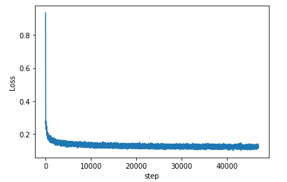

# Basic Auto Encoder with MNIST data
오토 인코더의 기본 모델. MNIST 데이터셋을 이용한다.
=

오토 인코더의 목적
-
>인코더는 Data의 특징을 표현할 수 있도록 학습 한다.   
>디코더는 인코더의 output인 Data 특성을 이용해 해당 Data를 복원할 수 있도록 학습한다.   
>그 결과 인코더는 Data의 특징을 잘 표현할 수 있으며, Data의 특징을 잘 나타내는 Manifold를 잘 찾아낼 수 있게 된다.   
>c.f.) basic AutoEncoder는 성능이 그닥 좋진 못하다.   

과정 설명(자세한 건 쥬피터 노트북 주석을 따라가면 된다.)
-
>1.Torchivision을 이용해 MNIST 데이터를 다운 받는다.   
>2.AutoEncoder 모델을 구현한다.    
>3.100 epoch 학습 시킨다. 10epoch 마다 고정된 validation data로 MNIST 데이터(손글씨 숫자)를 생성한다.   
>[코드 copy는 이 repo를 보고 했다.] : (https://github.com/L1aoXingyu/pytorch-beginner/tree/master/08-AutoEncoder)   

- requirements
  - pytorch (딥러닝 프레임워크)   
  - torchvision (pytorch의 이미지 데이터 처리 툴)
  - numpy (image plot할 때 numpy array에 담아 처리한다.)
  - matplotlib (image 및 그래프를 보여주는 라이브러리)

Validation data (아래 6개 데이터로 고정한다.)
-

10,20 Epoch 결과 Validation
-
10 epcoh일 때의 결과이며, 위의 validation data를 은근히 잘 복원해 내는 모습이다. 하지만 블러가 있는 모습
   
20 epoch일 때의 결과이며, 10epoch 보다 블러가 확연히 줄어든 모습이다.

100 epoch일 때의 결과이며, 20epoch 과 크게 다르지 않다.(loss값이 0.02 줄었다고 validation data에 대해선 큰 성능 차이가 없다. 20epoch이 됐을 때 이미 fit 된 것이 아닐까 싶다.)

Loss 값 Graph
-
학습 초반엔 감소 하다가 0.11부근에서 fit 되고, 학습 끝날 때 까지 진동하는 모습  

