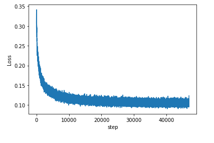

# Convolution Auto Encoder with MNIST data
오토 인코더를 MLP(Multilayer Perceptron) 대신 Convolution 신경망으로 구성했다. MNIST 데이터셋을 이용한다.
=

오토 인코더의 목적
-
>인코더는(Convolution) Data의 특징을 표현할 수 있도록 학습 한다.   
>디코더는(Convolution Transpose, 컨볼루션과 반대로 이미지를 크게 만들기에 원본 이미지 복원이 가능) 인코더의 output인 Data 특성을 이용해 해당 Data를 복원할 수 있도록 학습한다.   
>그 결과 인코더는 Data의 특징을 잘 표현할 수 있으며, Data의 특징을 잘 나타내는 Manifold를 잘 찾아낼 수 있게 된다.   
>c.f.) basic AutoEncoder보다 성능이 월등히 향상됐다.  

과정 설명(자세한 건 쥬피터 노트북 주석을 따라가면 된다.)
-
>1.Torchivision을 이용해 MNIST 데이터를 다운 받는다.   
>2.AutoEncoder 모델을 구현한다.    
>3.100 epoch 학습 시킨다. 10epoch 마다 고정된 validation data로 MNIST 데이터(손글씨 숫자)를 생성한다.   
>[코드 copy는 이 repo를 보고 했다.] : (https://github.com/L1aoXingyu/pytorch-beginner/tree/master/08-AutoEncoder)   

- requirements
  - pytorch (딥러닝 프레임워크)   
  - torchvision (pytorch의 이미지 데이터 처리 툴)
  - numpy (image plot할 때 numpy array에 담아 처리한다.)
  - matplotlib (image 및 그래프를 보여주는 라이브러리)

Validation data (아래 6개 데이터로 고정한다.)
-

100 Epoch 결과 Validation
-
Validation data와 똑같은 데이터를 복원해 내야 하며, 블러가 있지만 원본 숫자 이미지를 잘 복원했다.(단, 3,5,8 숫자가 비슷하게 생겼기에 그 숫자들은 블러가 좀더 심하다)

Loss 값 Graph
-
Loss 값이 단조 감소하다가 local optima 부근에서 fitting 된 모습을 보인다.   

